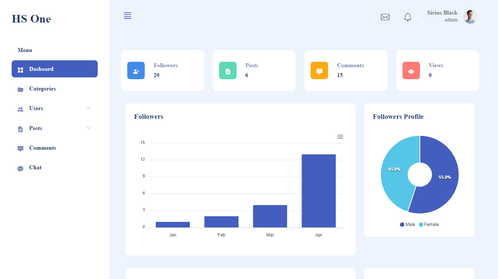

<div id="top"></div>

<!-- PROJECT LOGO -->
<br />
<div align="center">
  <a href="https://github.com/heidesebastiao95/CMS-Panel">
    
  </a>
  <h3 align="center">CMS ADMIN PANEL</h3>
</div>
<!-- ABOUT THE PROJECT -->

## About The Project

<div align="center">
<a href="https://github.com/heidesebastiao95/CMS-Panel">
    
  </a>
</div>
 <br>
 <p>This project is an administrative panel for simple blogs, simple and beautiful with interesting resources for those who are starting to develop web with the laravel framework.</p>

Feactures:
* ✅Fully Responsive
* ✅Authentication
* ✅Ajax Request (No reload page)
* ✅User Activity
* ✅Chat Application
* ✅API REST Integration
* ✅Chat Application
* ✅Test Unit
* ✅And More

### Built With
* [![Laravel][Laravel.com]][Laravel-url]
* 
* 
* 
* 
* [![Bootstrap][Bootstrap.com]][Bootstrap-url]
* [![JQuery][JQuery.com]][JQuery-url]

<p align="right">(<a href="#top">back to top</a>)</p>


<!-- GETTING STARTED -->
## Getting Started

### Installation

1. Clone the repo
   ```sh
   git clone https://github.com/heidesebastiao95/CMS-Panel.git
   ```
2. Create Database
   ```sh
    php artisan db create database blog_register
   ```
3. And run the initial migrations
   ```js
   php artisan migrate
   ```

<p align="right">(<a href="#top">back to top</a>)</p>

<!-- CONTRIBUTING -->
## Contributing

Contributions are what make the open source community such an amazing place to learn, inspire, and create. Any contributions you make are **greatly appreciated**.

If you have a suggestion that would make this better, please fork the repo and create a pull request. You can also simply open an issue with the tag "enhancement".
Don't forget to give the project a star! Thanks 🖖🏽🖖🏽!

1. Fork the Project
2. Create your Feature Branch (`git checkout -b feature/AmazingFeature`)
3. Commit your Changes (`git commit -m 'Add some AmazingFeature'`)
4. Push to the Branch (`git push origin feature/AmazingFeature`)
5. Open a Pull Request

<p align="right">(<a href="#top">back to top</a>)</p>

<!-- ACKNOWLEDGMENTS -->
## Acknowledgments
Credit to UI Material !
* [Mazer Dashboard](https://github.com/zuramai/mazer)

<p align="right">(<a href="#top">back to top</a>)</p>


<!-- MARKDOWN LINKS & IMAGES -->
<!-- https://www.markdownguide.org/basic-syntax/#reference-style-links -->
[contributors-shield]: https://img.shields.io/github/contributors/othneildrew/Best-README-Template.svg?style=for-the-badge
[contributors-url]: https://github.com/othneildrew/Best-README-Template/graphs/contributors
[forks-shield]: https://img.shields.io/github/forks/othneildrew/Best-README-Template.svg?style=for-the-badge
[forks-url]: https://github.com/othneildrew/Best-README-Template/network/members
[stars-shield]: https://img.shields.io/github/stars/othneildrew/Best-README-Template.svg?style=for-the-badge
[stars-url]: https://github.com/othneildrew/Best-README-Template/stargazers
[issues-shield]: https://img.shields.io/github/issues/othneildrew/Best-README-Template.svg?style=for-the-badge
[issues-url]: https://github.com/othneildrew/Best-README-Template/issues
[license-shield]: https://img.shields.io/github/license/othneildrew/Best-README-Template.svg?style=for-the-badge
[license-url]: https://github.com/othneildrew/Best-README-Template/blob/master/LICENSE.txt
[linkedin-shield]: https://img.shields.io/badge/-LinkedIn-black.svg?style=for-the-badge&logo=linkedin&colorB=555
[linkedin-url]: https://linkedin.com/in/othneildrew
[product-screenshot]: images/screenshot.png
[Next.js]: https://img.shields.io/badge/next.js-000000?style=for-the-badge&logo=nextdotjs&logoColor=white
[Next-url]: https://nextjs.org/
[React.js]: https://img.shields.io/badge/React-20232A?style=for-the-badge&logo=react&logoColor=61DAFB
[React-url]: https://reactjs.org/
[Vue.js]: https://img.shields.io/badge/Vue.js-35495E?style=for-the-badge&logo=vuedotjs&logoColor=4FC08D
[Vue-url]: https://vuejs.org/
[Angular.io]: https://img.shields.io/badge/Angular-DD0031?style=for-the-badge&logo=angular&logoColor=white
[Angular-url]: https://angular.io/
[Svelte.dev]: https://img.shields.io/badge/Svelte-4A4A55?style=for-the-badge&logo=svelte&logoColor=FF3E00
[Svelte-url]: https://svelte.dev/
[Laravel.com]: https://img.shields.io/badge/Laravel-FF2D20?style=for-the-badge&logo=laravel&logoColor=white
[Laravel-url]: https://laravel.com
[Bootstrap.com]: https://img.shields.io/badge/Bootstrap-563D7C?style=for-the-badge&logo=bootstrap&logoColor=white
[Bootstrap-url]: https://getbootstrap.com
[JQuery.com]: https://img.shields.io/badge/jQuery-0769AD?style=for-the-badge&logo=jquery&logoColor=white
[JQuery-url]: https://jquery.com 
